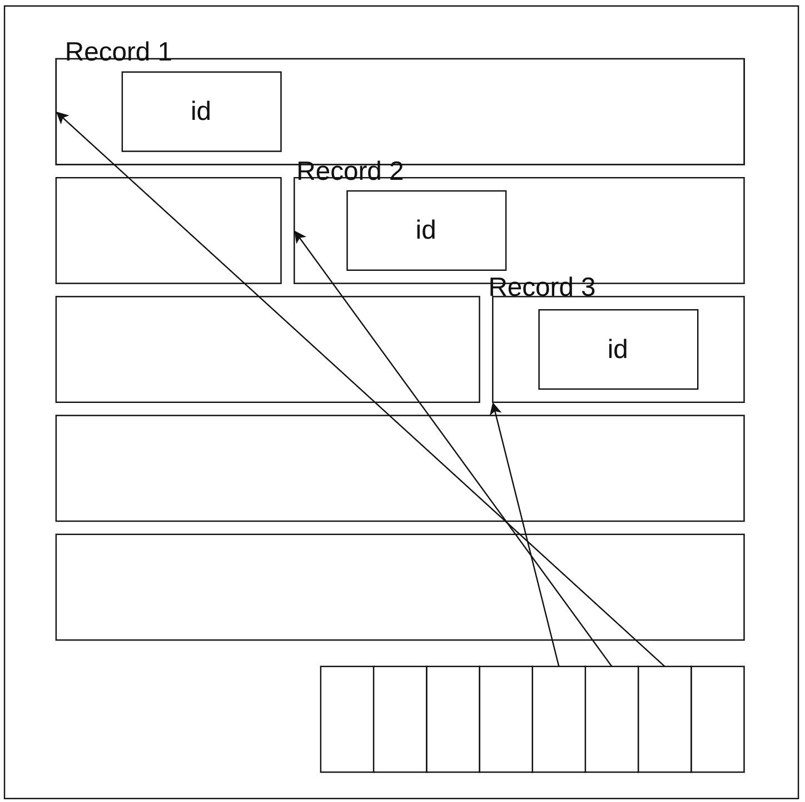
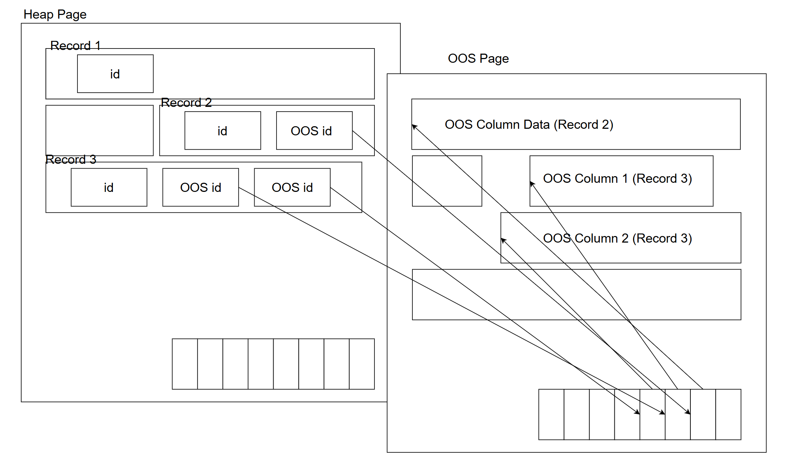

# 큐브리드 대용량 컬럼 저장 및 조회 구조 개선

>큐브리드 **Out-of-Line Overflow Column Storage** 도입 계획

개발2팀 김대현


---

## 🎯 목차

- 배경 - 현재 CUBRID **대용량 컬럼 처리**의 한계
- 요구사항 - 불필요한 Column에 대한 I/O 최소화
- 주요 DBMS(PostgreSQL, MySQL) 사례 비교
  * 용어 정의:
    Out-of-Line Storage 란?
  * 사례
    - **PostgreSQL TOAST** (The Oversized-Attribute Storage Technique)
    - **MySQL InnoDB off-page**
- 큐브리드의 개선 방향성 제안

---

## 배경: 현재 CUBRID **대용량 컬럼 처리** 문제점

http://jira.cubrid.com/browse/RND-2591

---



## id 만 읽어오고 싶은데...?


---

## ⚠️ 현재 문제점

매우 큰 컬럼이 포함된 테이블에서 일부 컬럼만 조회 시에도 불필요한 대용량 컬럼까지 모두 디스크에서 읽어오는 비효율 발생

```sql
create table tbl (id int, txt varchar); -- 매우 큰 varchar 컬럼

-- insert 1000000 rows...
insert into tbl values (1, repeat('A', 1000));
insert into tbl values (2, repeat('B', 10000));
insert into tbl values (3, repeat('C', 100000)); -- Worse! Goes to Overflow Page

...

select id from tbl;
-- tip! string compression is disabled for easier understanding
```

- 큐브리드 현재 동작 방식
  - `id` 컬럼만 조회해도 ???

- 결과
  - ???
  - 큰 VARCHAR / LOB / Vector 컬럼이 많을수록 ???

---
	
## ⚠️ 현재 문제점

매우 큰 컬럼이 포함된 테이블에서 일부 컬럼만 조회 시에도 불필요한 대용량 컬럼까지 모두 디스크에서 읽어오는 비효율 발생

```sql
create table tbl (id int, txt varchar); -- 매우 큰 varchar 컬럼

-- insert 1000000 rows...
insert into tbl values (1, repeat('A', 1000));
insert into tbl values (2, repeat('B', 10000));
insert into tbl values (3, repeat('C', 100000)); -- Worse! Goes to Overflow Page

...

select id from tbl;
-- tip! string compression is disabled for easier understanding
```

- 큐브리드 현재 동작 방식
  - `id` 컬럼만 조회해도 **txt까지 포함해서 레코드 전체를 디스크에서 fetch**

- 결과
  - 불필요한 I/O 발생 → **성능 저하**
  - 큰 VARCHAR / LOB / Vector 컬럼이 많을수록 **악영향**

---

### ✅  요구사항

* **IO 최적화**

  - 특정 필요한 컬럼만 조회 시 레코드 전체를 디스크에서 fetch하지 않도록 I/O 최적화
    * 너무 큰 크기의 컬럼은 별도 저장소에 저장하여, 필요한 경우에만 접근하도록 개선
    * Heap 페이지 내에 포인터만 저장

* **기능적 안정성**
  - Recovery / Replication / HA 환경에서 Out-of-Line 컬럼도 정상 동작해야 함
  - DBMS 내부에서 Out-of-Line 컬럼 데이터 관리 (외부 파일 아님)

---

## 주요 DBMS(PostgreSQL, MySQL) 사례 비교

* 용어 정의
* 사례
  - **PostgreSQL TOAST** (The Oversized-Attribute Storage Technique)
  - **MySQL InnoDB off-page**

---

## 용어 정의 및 설명

### Oversized Attribute Storage 이란?

* **The Over-sized Attribute Storage Technique** (TOAST)
* 레코드(튜플)을 연속적으로 저장하지 않고, 큰 속성 (Attribute)를 튜플로부터 떨어진 다른 **보조 저장소에 저장**하고, 기존
  레코드에는 데이터에 대한 **포인터**를 남겨 **튜플 크기를 줄이는** 기법
* 해당 **보조 저장소**는 여전히 DBMS에 의해 관리됨.
* 주의:
  **외부 저장소**라고 표현할 경우, BFILE, BLOB External 등과 같이 OS File Storage 와 혼동할 수 있음.

---

## 비슷한 용어들 (공식 문서 기준)

- Out of Line 저장 (PostgreSQL, Oracle)
- Toast 저장 (PostgreSQL)
- Off-page 저장 (InnoDB)
- Overflow pages (InnoDB)

* 본 발표에서는 **Out of Line 저장 기법**이라는 용어로 통일

---

## 🏗️ 타 DBMS 사례


| DBMS            | 방식/이름                                  | 특징                                                    |
|-----------------|-------------------------------------------|---------------------------------------------------------|
| **PostgreSQL**  | TOAST (The Oversized-Attribute Storage Technique) | 큰 컬럼 값을 별도 테이블에 저장, 필요 시 잘라서 접근            |
| **MySQL (InnoDB)** | Off-Page Storage (Singly-Linked Overflow Pages) | 큰 데이터를 페이지 밖에 저장, 오버플로우 페이지 체인으로 연결     |
| **Oracle** | Internal LOB Storage | LOB 데이터 타입만 적용  |

---

## PostgreSQL: TOAST 

- 레코드 크기가 대략 2KB를 넘을 시, 컬럼들을 큰 순서대로 **TOAST 테이블**로 분리
- 분할하여 하나의 TOAST 테이블에 저장
    - 모든 테이블은 **단 하나**의 숨겨진 TOAST 테이블을 소유하고 있음.
- 분할 데이터는 (chunk_id, chunk_seq) 부여.
  유니크 인덱스가 걸려 있음.

---

## TOAST 과정

1) Record 크기가 Threshold (~2kB) 이상일 경우,
2) 압축을 시도
3) 큰 속성부터 차례대로
    1) Toast **가능 여부** 검사 (**PLAIN**으로 회피 가능)
	2) Toast Table에 해당 컬럼 값을 따로 삽입
4) **2, 3** 과정 후에도 만약 8kB 이상일 경우 **에러 처리**

---

## 📍TOAST 레코드 단위 동작 

```sql
CREATE TABLE tbl (a VARCHAR, b VARCHAR);
iNSERT INTO tbl VALUES (repeat('A', 4), repeat('B', 4);
iNSERT INTO tbl VALUES (repeat('A', 4), repeat('B', 4000));
iNSERT INTO tbl VALUES (repeat('A', 4000), repeat('B', 4));
iNSERT INTO tbl VALUES (repeat('A', 4000), repeat('B', 4000));
```

- **레코드 단위**로 TOAST 여부가 결정됨

1) 둘 다 TOAST 안 함
2) b만 TOAST
3) a만 TOAST
4) 두 컬럼 모두 TOAST

* 즉, **같은 테이블, 같은 컬럼**이라도 TOAST 될 수도, 안 될 수도 있음.

<!-- ### PostgreSQL Toast 제어 -->
<!---->
<!-- - 특정 컬럼만을 항상 Toast로 보내기 불가능 ❌ -->
<!-- * 특정 컬럼만을 항상 Toast 금지 가능 ✅  -->
<!-- 	- 단, 8kB 에러 주의 ⛔️ -->
<!-- - 임의로 TOAST 촉발(trigger)시키는 것은 불가능하다 (Threshold 2kB) ❌ -->
<!-- * TOAST 촉발되었을 경우, 나누는 크기 조절 가능 ✅ -->
<!-- * TOAST 이후 남은 튜플 크기 조절 가능 ✅ -->
<!-- - 압축 알고리즘 컬럼 단위로 설정 가능 ✅ -->

---

## Toast 특이사항

- Toast 된 값들은 수정될 경우 힙에서 delete + insert 처리됨

---

## MySQL (InnoDB)

- 레코드 크기가 Page Size (기본 16K) 절반을 넘을 경우,
  * 큰 Attribute부터 차례로 Off-Page Storage로 이주
  * 20바이트 포인터만 레코드에 남음
  * Off-Page Column Storage는 **Singly Linked Overflow Pages**로 구현되어 있음

---

<!-- ## MySQL Off-Page 과정 -->
<!---->
<!-- - 테이블⚠️ 별로 설정하는 Row Format 으로 제어 -->
<!-- 	- Pg와 달리 컬럼별 설정 불가능 ❌ -->
<!-- - Row Format 종류: -->
<!-- 	- Dynamic (Default), Compressed -->
<!-- 	* (Old) Redundant, Compact -->
<!---->
<!-- --- -->

## MySQL Row Format

- Dynamic Row Format (Default), Compressed
	- **큰 속성부터 차례로** Off-Page Storage로 이주
	- 20바이트 포인터만 레코드에 남음
	- **각 행은** 각각 Off-Page Storage를 가지고 있으며, **Singly Linked Overflow Pages**로 구현되어
   있음
	- **50바이트 이하는** Off-Page로 가지 않음 ✅
* Redundant, Compact ⚠️
	- 768바이트는 Record에 남겨두고, 나머지 (size - 768) byte는 Off-Page Storage로 보냄
  - 과거의 Default 방식

---

<!-- ## MySQL 유저 레벨 제어 -->
<!---->
<!-- - 컬럼 기반 제어 불가능 -->
<!-- 	- 특정 컬럼만을 Off Page 하지 않기 불가능 ❌ -->
<!-- 	- 특정 컬럼만을 Off Page 하기 불가능 ❌ -->
<!-- - Off-Page 임계치(threshold)는 page_size/2   -->
<!-- 	- Page Size를 바꿔야만 기준 변경 가능 ⚠️   -->
<!-- 	- REDUNDANT, COMPACT 에서는 항상 768B In-row 고정 ⚠️ -->
<!-- - Off Page 이후 남은 튜플 크기 조절 불가능 ❌ -->
<!-- - 압축 알고리즘은 테이블 단위 설정 ⚠️ -->
<!---->
<!-- --- -->

<!-- ## Oracle -->
<!---->
<!-- - BLOB, CLOB, BFILE, CFILE 타입만 지원 -->
<!-- 	* 개발자가 타입을 명시해야 함 ⚠️ -->
<!-- 	* 행의 나머지 타입들은 항상 연속적으로 저장 -->
<!-- - 한 행 크기가 블록 (페이지) 크기를 넘어갈 경우 (!) -->
<!-- 	* Row Chaining: -->
<!--    여러 블록에 나누어 저장 후 체인 포인터로 연결 -->
<!-- - 큰 데이터에 대해서는 사용자가 직접 LOB(SECUREFILE) 컬럼 지정 및 사용 권장 ⚠️ -->
<!---->
<!-- --- -->


## MySQL 특이사항

- 컬럼끼리 Overflow Page 를 공유하지 않음 -> 1개의 Overflow Page에는 1개의 컬럼 데이터만 존재
* 16 KB Overflow Page에 4KB 크기의 Off-Page Column 1개만 저장한다면...?
  **12KB 낭비!**
* Overflow Page 내부 남은 공간은?
  * InnoDB 내부적 Page 압축 기법인 **Transparent Page Compression** 적용
  * `fallocate(...FALLOC_FL_PUNCH_HOLE)` 등 시스템 콜을 통해 논리 저장 구조는 유지하되, 물리 디스크 공간 해제
    -> 실질적으로 OS 단에서 **물리적 공간 낭비 최소화 + Disk IO Fetch 최적화**
    * 단, 운영체제 및 파일시스템 지원 필요
      * Windows 에서는 NTFS 파일 시스템을 따로 빌드해야 함
        - https://dev.mysql.com/doc/refman/8.4/en/innodb-page-compression.html

---

## 🔒 벤더별 제약사항 비교

|DBMS|컬럼 단위 제어|Threshold 제어|분할 저장(청크)|아키텍처|
|----|--------------|--------------|----------------|---------|
|**PostgreSQL (TOAST)**|가능 (STORAGE 옵션)|불가능 (2KB~ 자동)|있음 (chunk 단위)|테이블 당 내부 테이블 1개|
|**MySQL (InnoDB Off-Page)**|불가능|Page Size 변경 필요 (기본 16KB → 8KB 기준)|없음 (컬럼값 통째로)|Overflow Page Chain|

<!-- |**Oracle**|불가능|불가능|없음 (Row Chaining만)|필요 (BLOB, CLOB, SecureFile)|일반 컬럼은 무조건 in-row 저장| -->

---

## ✅ 결론

- 현재 문제 - 필요하지 않아도, 모든 컬럼을 디스크에서 읽는 비효율
- 해결책 - 큐브리드도 **과도하게 큰 Column을** Heap이 아닌, **Out-of-Line Storage에** 저장하자

---

## 큐브리드의 개선 방향성 제안

CUBRID Out-of-Line Overflow Column Storage (OOS) 도입

목표 - 대용량 컬럼 분리 저장으로 I/O 효율 향상

---

## 1️⃣ 기본 구조

|구성요소|설명|
|---|---|
|**Heap Page**| 기본 레코드 저장, OOS 컬럼은 실제 데이터 대신 **OOS 포인터 (OOS id)** 만 저장 |
|**OOS Page**| 실제 대용량 컬럼 데이터를 저장 |
|**Overflow Page**| **Deprecated due to OOS**...? |


* Overflow Page는 OOS 도입 후 역할이 겹침

---

## 2️⃣ OOS 조건

- 레코드 크기 계산
  * INSERT/UPDATE 시 튜플 크기 판단 → 레코드 크기가 **Threshold (예:8KB)** 초과 시 OOS 대상 선별
  * 크기 기준 정렬 후 레코드 크기가 Threshold 이하가 될 때까지 OSS

---



---

### 🧮 4. 기대 효과

|항목|효과|
|---|---|
|**Full Scan 효율**|대용량 컬럼 I/O 제거|
|**Page 밀도 향상**|더 많은 레코드 캐시 가능|
|**Update 효율**|비변경 컬럼에 대한 OOS 접근 불필요|


### ⚠️ 5. 고려사항

|항목|내용|
|---|---|
|**MVCC 지원**|Undo/Redo 시 OOS 메타데이터 동기화|
|**Backup/HA**|Log-based OOS 변경 추적 필요|
|**Recovery**|OOS Page Consistency 보장 필요|

---

## 설계 방향

#### 아키텍처 옵션

| 수준     | 구분         | 비고 |
| ------ | ---------- | -- |
| DB 단위  | 1개 OOS 영역  | drop table, drop column 연산 어려움 |
| 테이블 단위 | 개별 OOS 영역  | PostgreSQL Toast |
| 컬럼 단위  | 컬럼 별 OOS 저장 | Columnar Storage 형식 |
| 값 단위 | 개별 값마다 독자적인 OOS page chain | MySQL InnoDB Off-page + Transparent Page Compression |

#### 구현 방안 옵션

| 방법                   | 설명             | 특징 |
| -------------------- | -------------- | --- |
| Overflow Page 모방     | 기존 구조 재활용      | 남은 공간 활용 어려움 |
| Slotted Page 기반      | 단편화 최소화        | 접근 시 Page Lock 관리 필요 |
| 테이블 API 활용           | 기존 스토리지 API 호환 | 중복 트랜잭션 처리, 큰 레코드 (large OOS column payload) 에 대해 같은 문제 발생 |
| 외부 Object Storage 연계 | 확장성 고려         | Recovery, Backup 복잡도 증가 |


---

#### Update 시나리오 옵션

| 방식                  | 설명                | 특징 |
| ------------------- | ----------------- | -- |
| **In-place Update** | 동일 크기 시 직접 갱신 + 크기 변화 시 OOS id 교체 | 이전 버전 로그에 유지 |
| **Append Only Update** |  Update는 항상 Insert 취급, OOS id 항상 교체 | 이전 버전을 OOS에 보관 |


<!-- #### (Slotted Page 사용할 시) Fragmentation 해결 방식 -->
<!---->
<!-- | 방식                  | 설명                | 특징 | -->
<!-- | ------------------- | ----------------- | -- | -->
<!-- | **In-page compaction** | page 내부에서 fragmented free space 확보 | Slotted Page 사용 시 OOS id 유지 | -->
<!-- | **Across-page compaction** |  여러 개의 page에 나뉜 데이터를 하나로 합치고 빈 페이지 반환 작업 | OOS id 변경됨 | -->

---

> Q&A
